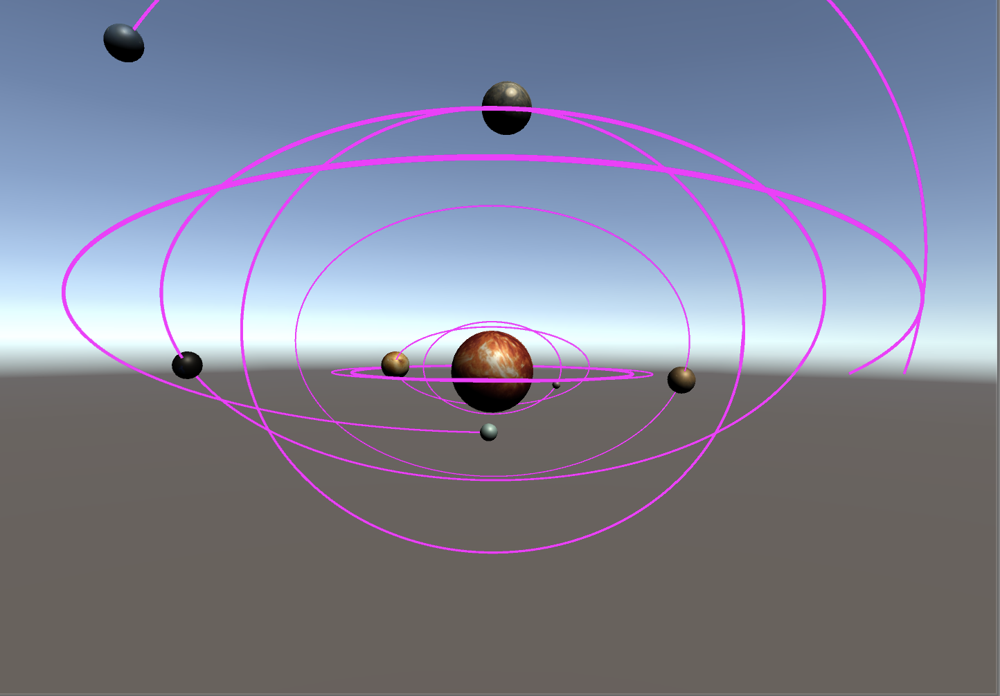

## 1、简单并用程序验证

- 游戏对象运动的本质是什么？

  本质上是游戏对象坐标的变换

- 使用三种方法实现物体的抛物线运动

  1. Vector3.MoveTowards

     ```C#
     private float step = Time.deltaTime;
     
     // Update is called once per frame
     void Update () {
         float step = Time.deltaTime;
         if (flag) {
             if (origin - 100 * Time.deltaTime < 0.00001) {
                 Vector3 target = transform.position + Vector3.right * Time.deltaTime + Vector3.down * Time.deltaTime;
                 transform.position = Vector3.MoveTowards(transform.position, target, step);
             } else if (origin - 200 * Time.deltaTime < 0.00001) {
                 Vector3 target = transform.position + Vector3.right * Time.deltaTime + Vector3.up * Time.deltaTime;
                 transform.position = Vector3.MoveTowards(transform.position, target, step);
             } else {
                 flag = false;
             }
             origin += Time.deltaTime;
         } else { /*backward*/ }
     }
     ```

  2. Vector3.Lerp

     ```c#
     void Update {
         if (flag) {
           if (origin - 100 * Time.deltaTime < 0.00001) {
               Vector3 target = transform.position + Vector3.right * Time.deltaTime + Vector3.down * Time.deltaTime;
               transform.position = Vector3.Lerp(transform.position, target, 1);
           } else if (origin - 200 * Time.deltaTime < 0.00001) {
               Vector3 target = transform.position + Vector3.right * Time.deltaTime + Vector3.up * Time.deltaTime;
               transform.position = Vector3.Lerp(transform.position, target, 1);
           } else {
               flag = false;
           }
           origin += Time.deltaTime;
       } else { /*backward*/ }
     }
     ```

  3. 利用transform属性

     ```c#
     private float origin = Time.deltaTime;
     private bool flag = true;
     
     // Update is called once per frame
     void Update () {
         if (flag) {
             if (origin - 100 * Time.deltaTime < 0.00001) {
                 transform.position += Vector3.down * Time.deltaTime;
                 transform.position += Vector3.right * Time.deltaTime;
             } else if (origin - 200 * Time.deltaTime < 0.00001) {
                 transform.position += Vector3.up * Time.deltaTime;
                 transform.position += Vector3.right * Time.deltaTime;
             } else {
                 flag = false;
             }
             origin += Time.deltaTime;
         } else {
             if (origin - 100 * Time.deltaTime > 0.00001) { 
                 transform.position += Vector3.down * Time.deltaTime;
                 transform.position += Vector3.left * Time.deltaTime;
             } else if (origin > 0.00001) {
                 transform.position += Vector3.up * Time.deltaTime;
                 transform.position += Vector3.left * Time.deltaTime;
             } else {
                 flag = true;
             }
             origin -= Time.deltaTime;
         }
     }
     ```

- 写一个程序，实现一个完整的太阳系， 其他星球围绕太阳的转速必须不一样，且不在一个法平面上。

  实现太阳系，使用RotateRound函数即可，第一个参数是选择旋转的中心，第二个参数是选择旋转围绕的方向，为了使每个星球在不同法平面旋转，需要适当调整这个值。具体代码如下：

  `move.cs`

  ```c#
  using System.Collections;
  using System.Collections.Generic;
  using UnityEngine;
  
  public class move : MonoBehaviour
  {
      public Texture2D img;
  	public Transform sun;
      public Transform waterplanet;
      public Transform earth;
      //public Transform moon;
      public Transform goldplanet;
      public Transform mars;
      public Transform woodplanet;
      public Transform mudplanet;
      public Transform tianwang;
      public Transform haiwang;
      // Start is called before the first frame update
      private void OnGUI()
      {
          //GUIStyle bg = new GUIStyle();
          //bg.normal.background = img;
          //GUI.Label(new Rect(0, 0, 1024, 781), "", bg);
      }
      // Update is called once per frame
      void Update()
      {
          sun.Rotate(Vector3.up * 3 * Time.deltaTime);
          waterplanet.RotateAround(sun.position, new Vector3(0,1,1), 200 * Time.deltaTime);
          goldplanet.RotateAround(sun.position, new Vector3(0, 2, 1), 100 * Time.deltaTime);
          earth.RotateAround(sun.position, Vector3.up, 50 * Time.deltaTime);
          //moon.RotateAround(earth.position, new Vector3(0,0.1f,0.1f), 100 * Time.deltaTime);
          mars.RotateAround(sun.position, new Vector3(0, 2, 2), 40 * Time.deltaTime);
          woodplanet.RotateAround(sun.position, new Vector3(0, 1, 2), 30 * Time.deltaTime);
          mudplanet.RotateAround(sun.position, new Vector3(0, 3, 2), 20 * Time.deltaTime);
          tianwang.RotateAround(sun.position, new Vector3(0, 3, 1), 10 * Time.deltaTime);
          haiwang.RotateAround(sun.position, new Vector3(0, 2, 4), 5 * Time.deltaTime);
      }
  }
  
  ```

  `earth_moon.cs`

  地月是一个子系统，需要单独来写。

  ```C#
  using System.Collections;
  using System.Collections.Generic;
  using UnityEngine;
  
  public class earth_moon : MonoBehaviour
  {
      public Transform earth;
      public Transform moon;
      // Start is called before the first frame update
      void Start()
      {
          
      }
  
      // Update is called once per frame
      void Update()
      {
          moon.RotateAround(earth.position, Vector3.up, 100 * Time.deltaTime);
      }
  }
  
  ```

  最后运行截图如下：
  

## 2、编程实践

- 阅读以下游戏脚本

> Priests and Devils
>
> Priests and Devils is a puzzle game in which you will help the Priests and Devils to cross the river within the time limit. There are 3 priests and 3 devils at one side of the river. They all want to get to the other side of this river, but there is only one boat and this boat can only carry two persons each time. And there must be one person steering the boat from one side to the other side. In the flash game, you can click on them to move them and click the go button to move the boat to the other direction. If the priests are out numbered by the devils on either side of the river, they get killed and the game is over. You can try it in many > ways. Keep all priests alive! Good luck!

程序需要满足的要求：

- play the game ( http://www.flash-game.net/game/2535/priests-and-devils.html )

- 列出游戏中提及的事物（Objects）

  河流、小船、牧师、魔鬼、岸

- 用表格列出玩家动作表（规则表），注意，动作越少越好

  | 牧师、魔鬼 | 上船、下船       |
  | ---------- | ---------------- |
  | 船         | 载着人物驶向对岸 |

- 请将游戏中对象做成预制


- 在 GenGameObjects 中创建 长方形、正方形、球 及其色彩代表游戏中的对象。
- 使用 C# 集合类型 有效组织对象
- 整个游戏仅 主摄像机 和 一个 Empty 对象， **其他对象必须代码动态生成！！！** 。 整个游戏不许出现 Find 游戏对象， SendMessage 这类突破程序结构的 通讯耦合 语句。 **违背本条准则，不给分**
- 请使用课件架构图编程，**不接受非 MVC 结构程序**
- 注意细节，例如：船未靠岸，牧师与魔鬼上下船运动中，均不能接受用户事件

### 实现

使用MVC结构进行架构。

- model

  - Boat
  - Character
  - Coast
  - River

- View

  - UserGUI

    用于展示游戏界面，以及用户点击事件

- Controller

  - BoatController

    控制船的移动，以及船上人的信息

  - Charactercontroller

    人物的动作：上下船

  - CoastController

    河岸承担了与船的交互，以及人员的增减

  - director

  ```c#
      public class Director : System.Object
      {
          private static Director _instance;
  
          public ISceneController CurrentSecnController { get; set; }
          public static Director GetInstance()
          {
              return _instance ?? (_instance = new Director());
          }
      }
  ```

  ​	所有游戏只有一个实例，就是通过这个类来实例化的。

  - Interfaces

  - KernelController

    主要的控制器，控制了船的移动和游戏输赢的判定，它是一个Director类，控制着游戏的创建、加载等动作

  - Move

    所有对象移动的动作

[视频链接](https://v.youku.com/v_show/id_XNDM2NjY4NjAyMA==.html?spm=a2h3j.8428770.3416059.1)

[博客链接](https://blog.csdn.net/lxxnb666/article/details/101002625)