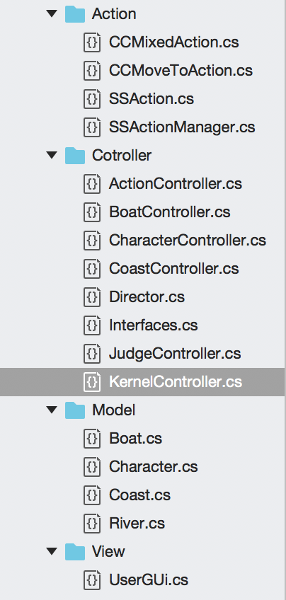
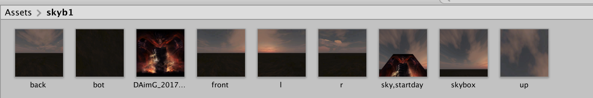
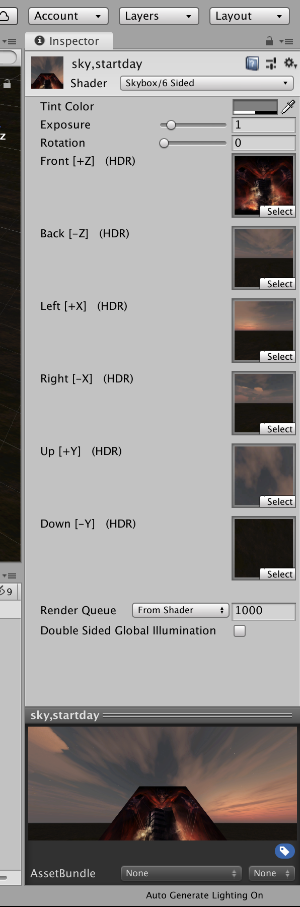
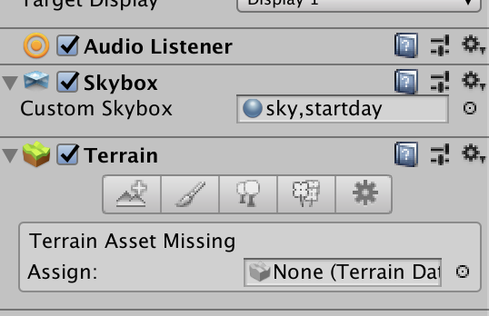
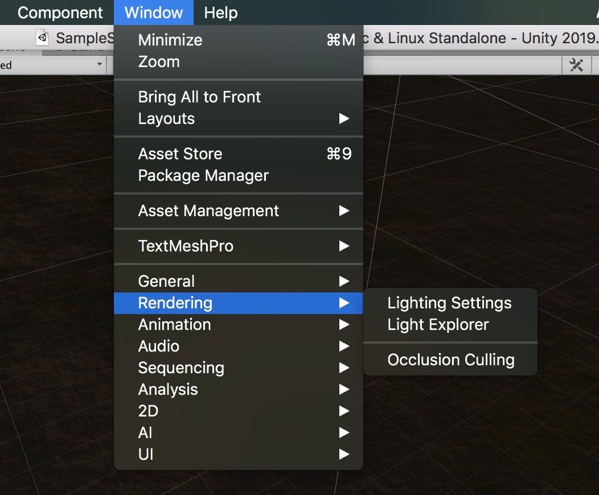
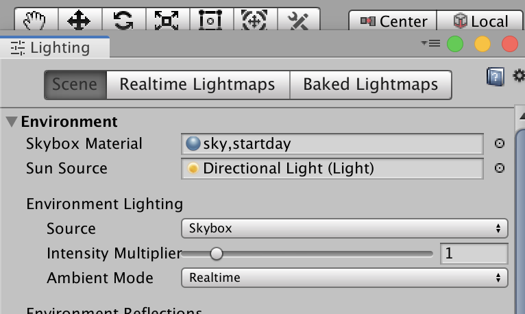
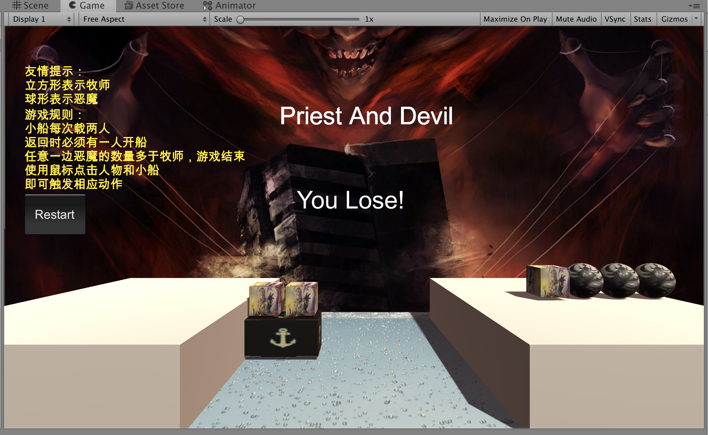

# 3D-牧师与魔鬼 动作分离版

> 本次作业要求将上一次的作业，物体的动作与他们的空间属性分开来，从而降低耦合，易于开发者维护，说实话做完之后感觉受益颇深

### 一、项目的脚本结构



### 二、先介绍一下动作管理器的结构

动作管理器内部主要有五个类

- SSAction

  整个游戏动作的基类，继承ScriptableObject，其他的所有的物体的动作都继承则个类，内涵两个纯虚函数Start、Update

  ```C#
  //这个类在我的另一个命名空间ACtionSpace中
  public class SSAction : ScriptableObject
      {
          public bool enable = true;
          public bool destroy = false;
  
          public GameObject gameobject { get; set; }
          public Transform transform { get; set; }
  
          //interface 里面定义的接口
          public ISSActionCallback callback { get; set; }
          // Use this for initialization
          public virtual void Start()
          {
              throw new System.NotImplementedException();
          }
  
          // Update is called once per frame
          public virtual void Update()
          {
              throw new System.NotImplementedException();
          }
      }
  ```

- CCMoveToAction

  此类的作是将一个物体移动到目标位置，并通知人物完成，这个类局限性在于他只能进行直线运动，不能转弯

  ```c#
  public class CCMoveToAction:SSAction
      {
          public Vector3 target;
          public float speed;
  
          public static CCMoveToAction GetSSAction(Vector3 target, float speed)
          {
              CCMoveToAction action = ScriptableObject.CreateInstance<CCMoveToAction> ();
              action.speed = speed;
              action.target = target;
              return action;
  
          }
  
          public override void Start()
          {
  
          }
  
          public override void Update()
          {
              this.transform.position = Vector3.MoveTowards(this.transform.position, target, speed*Time.deltaTime);
              if(this.transform.position == target)
              {
                  destroy = true;
                  callback.SSActionEvent(this);
              }
          }
      }
  ```

- CCSequenceAction

  CCMoveToAction 只是一个能够直线运动的模版，这个类就是将上面的类组合起来，由于model的动作都是直线运动，所以无需在创建其他类，对于人物来说他们的动作是折线运动，组合一下就好

  ```C#
  public class CCMixedAction:SSAction,ISSActionCallback
      {
          public List<SSAction> Actions;
          public int repeat = -1;
          public int start = 0;
          public static CCMixedAction GetSSAction(int repeat, int start, List<SSAction>Actions)
          {
              CCMixedAction action = ScriptableObject.CreateInstance<CCMixedAction>();
              action.repeat = repeat;
              action.start = start;
              action.Actions = Actions;
              return action;
          }
  
          public override void Update()
          {
              //如果系列动作都做完了
              if (Actions.Count == 0) return;
  
              //还没做完
              if (start < Actions.Count)
              {
                  Actions[start].Update();
              }
          }
  
          public void SSActionEvent(SSAction source)
          {
              source.destroy = false;
              this.start++;
              if(this.start >= this.Actions.Count)
              {
                  this.start = 0;
                  if (this.repeat > 0) this.repeat--;
                  if(this.repeat == 0)
                  {
                      this.destroy = true;
                      this.callback.SSActionEvent(this);
                  }
              }
          }
  
          public override void Start()
          {
              foreach (SSAction action in this.Actions)
              {
                  action.gameobject = this.gameobject;
                  action.transform = this.transform;
                  action.callback = this;
                  action.Start();
              }
          }
  
          //释放物体
          void OnDestroy()
          {
              foreach(SSAction action in this.Actions)
              {
                  DestroyObject(action);
                  //action.Destrio;
              }
          }
      }
  ```

- SSActionManager

  上面三个类已经是把动作给封装了起来，但是还没有对外的接口，这个类就属于对外的接口，有两个函数：

  - Update完成主要任务
  - - 通过对应的动作ID，将动作加入到字典中，便于后续的操作（不得不说，这个字典用的真妙，佩服）
    - 对于每一个动作，查看他们的完成情况，如果完成了那么就加入到删除队列，否则就完成这个动作
    - 删除完成了的动作
  - AddAction完成动作的添加

  ```C#
   public class SSActionManager:MonoBehaviour,ISSActionCallback
      {
          private Dictionary<int, SSAction> actions = new Dictionary<int, SSAction>();
          private List<SSAction> waitingAdd = new List<SSAction>();
          private List<int> waitingDel = new List<int>();
  
          public void Update()
          {
              //1 通过对应的动作ID，加入到字典中
              foreach(SSAction action in waitingAdd)
              {
                  actions[action.GetInstanceID()] = action;
              }
              waitingAdd.Clear();
  
              //2 对于每一个动作，查看他们的完成情况，如果完成了那么就加入到删除队列
              //否则就完成这个动作
              foreach(KeyValuePair<int,SSAction> actionKV in actions)
              {
                  SSAction action = actionKV.Value;
                  if(action.destroy)
                  {
                      waitingDel.Add(action.GetInstanceID());
                  }
                  else if(action.enable)
                  {
                      action.Update();
                  }
              }
  
              //3 对 在删除队列中的对象进行操作
              foreach(int actionID in waitingDel)
              {
                  SSAction action = actions[actionID];
                  actions.Remove(actionID);
                  DestroyObject(action);
              }
              waitingDel.Clear();
          }
  
          public void AddAction(GameObject gameobject, SSAction action, ISSActionCallback callback)
          {
              action.gameobject = gameobject;
              action.transform = gameobject.transform;
              action.callback = callback;
              waitingAdd.Add(action);
              action.Start();
          }
          public void SSActionEvent(SSAction source) { 
          }
      }
  ```

- ISSActionCallback

  这是一个接口类，主要有一个函数`void SSActionEvent(SSAction source)`放在了controller中的interfaces.cs中

### 三、新增ActionController类，为了能够与SSActionManager对接

在这里，彻底完成船和小车的运动轨迹

```c#
//通过使用SSactionManager中的函数
    //完成小船和人物的动作设计
    public class ActionController:SSActionManager
    {
        public void BoatMove(BoatController boatCtr)
        {
            CCMoveToAction action = CCMoveToAction.GetSSAction(boatCtr.GetDestination(), boatCtr.boat.speed);
            //Debug.Log("11");
            AddAction(boatCtr.boat._Boat, action, this);
        }

        public void CharacterMove(MySpace.CharacterController characterCtr, Vector3 destination)
        {
            Vector3 currentPos = characterCtr.character.Role.transform.position;
            Vector3 middlePos = currentPos;

            //终点如果Y坐标小，那么就是上船
            //如果大，那么就是下船
            if (destination.y > currentPos.y) middlePos.y = destination.y;
            else middlePos.x = destination.x;
            //Debug.Log("current"+currentPos);
            //Debug.Log("middle"+middlePos);
            //Debug.Log("destination"+destination);
            SSAction action1 = CCMoveToAction.GetSSAction(middlePos, characterCtr.character.speed);
            SSAction action2 = CCMoveToAction.GetSSAction(destination, characterCtr.character.speed);

            SSAction actions = CCMixedAction.GetSSAction(1, 0, new List<SSAction> { action1,action2});
            AddAction(characterCtr.character.Role, actions, this);
        }
    }
```

### 四、在`KernelController`中加入actionController，并且去除原先的Move函数及类型。同时将model里面的Move属性也删除。同时做一定的修改，这个就略过吧

### 五、增加裁判类，当游戏结束，通知场景控制器游戏结束

> 本来想直接使用UserGUI进行判断，但是其中的函数OnGUI每秒会刷新几次，所以就没再尝试。
>
> 这个裁判类其实就是将原来kernelCtr中的判断游戏结束函数封装到了裁判里面

在controller中，增加JudgeController类，主要通过两边岸上和船上的人数和类型进行判断游戏输赢。还有就是，要记得在kernelCtr重置时，judge也要重置。

```C#
//游戏判定主要是还是船上人物和岸上人物的数量及类型的判定
    public class JudgeController
    {
        public CoastController rightCoastCtr;
        public CoastController leftCoasrCtr;
        public BoatController boatCtr;
        public int Flag = 0;
        //0表示正在游戏
        //1表示win
        //-1表示输了
        public JudgeController(CoastController rightCoastCtr, CoastController leftCoasrCtr, BoatController boatCtr)
        {
            this.rightCoastCtr = rightCoastCtr;
            this.leftCoasrCtr = leftCoasrCtr;
            this.boatCtr = boatCtr;
        }
        public int judgeGameOver()
        {
            int rightP = 0;
            int leftP = 0;
            int rightD = 0;
            int leftD = 0;
            int flag = 0;

            rightP = rightCoastCtr.GetCharacterNum()[0];
            rightD = rightCoastCtr.GetCharacterNum()[1];
            leftP = leftCoasrCtr.GetCharacterNum()[0];
            leftD = leftCoasrCtr.GetCharacterNum()[1];

            if (leftD + leftP == 6) flag = 1; //win

            if (boatCtr.boat.location == Location.right)
            {
                rightP += boatCtr.GetCharacterNum()[0];
                rightD += boatCtr.GetCharacterNum()[1];
            }
            else
            {
                leftP += boatCtr.GetCharacterNum()[0];
                leftD += boatCtr.GetCharacterNum()[1];
            }

            if ((rightP < rightD && rightP > 0) || (leftP < leftD && leftP > 0)) flag = -1; //lose
            Flag = flag;                                                                                //Debug.Log("rightP" + rightP + " rightD" + rightD + " leftP" +leftP+" leftD"+leftD+" flag"+flag);
            return flag;
        }

        public void Reset()
        {
            Flag = 0;
        }
    }
```

### 六、增加天空盒，对场景进行美化

1. 在unity应用内部store中搜索sky box，找一个自己喜欢的，import下来，如下



2. 点击天空盒主体，其他的都是图片，很好判别，在右侧出现以下框框



3. 找到对应的位置，把图片拖进去就ok了，如果想使用自己的图片，也可以拖进去，我就是将天空盒的正面使用了自己的图片
4. 接下来，点击`main camera`，增加component，搜索`sky box`，添加进去，并且将sky box添加进去



5. 接下里点进去`lightting settings`



6. 设置成自己的天空盒



### 七、结果图



### 八、小提醒

别忘了将写好的actionController脚本也拖到`Empty`对象中，不然可能会报出“空的实例”之类的错误。

[演示视频](https://v.youku.com/v_show/id_XNDM3Njk5NjA5Ng==.html?spm=a2h0j.11185381.listitem_page1.5~A)

[博客地址](https://blog.csdn.net/lxxnb666/article/details/101487520)

